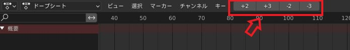
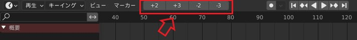
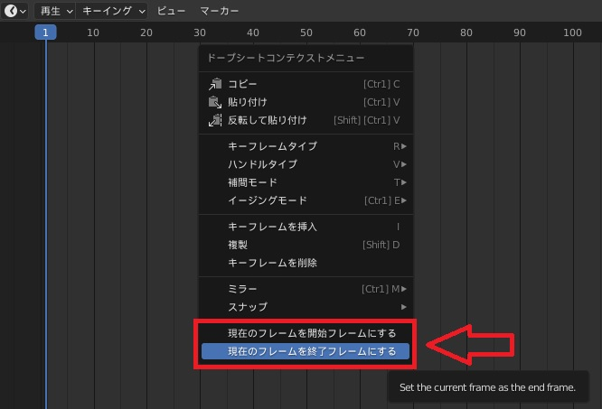

# MyBlenderAddon
self-made Blender Addon(Blender3.0,3.1動作確認)

## 導入方法
[【Blender】アドオンのインストール方法【具体的なやり方・GithubからのDL方法・うまくいかない時の対処法など】](https://bookyakuno.com/how-to-install-addon/)の「*単一ファイルをインストールする*」に書かれています

## skipframe アドオン
アニメーション作業時、数フレームスキップにするアドオン。2コマ作画や3コマ作画などリミテッドアニメーション作成に便利。ドープシート、タイムライン画面においてボタンが表示。

ドープシート画面

タイムライン画面

【ショートカットキー一覧】
- 1フレーム前進：テンキー1
- 2フレーム前進：テンキー2
- 3フレーム前進：テンキー3
- 4フレーム前進：テンキー4
- 1フレーム後進：Ctrl+テンキー1
- 2フレーム後進：Ctrl+テンキー2
- 3フレーム後進：Ctrl+テンキー3
- 4フレーム後進：Ctrl+テンキー4

ソースコード：skipframe.py

## set_start&end アドオン
アニメーション作業時、現時点のフレームを開始フレームまたは終了フレームにする機能をコンテキストメニューに追加するアドオン。
※コンテキストメニューは右クリックを押すと表示

    

ソースコード：click_startend.py